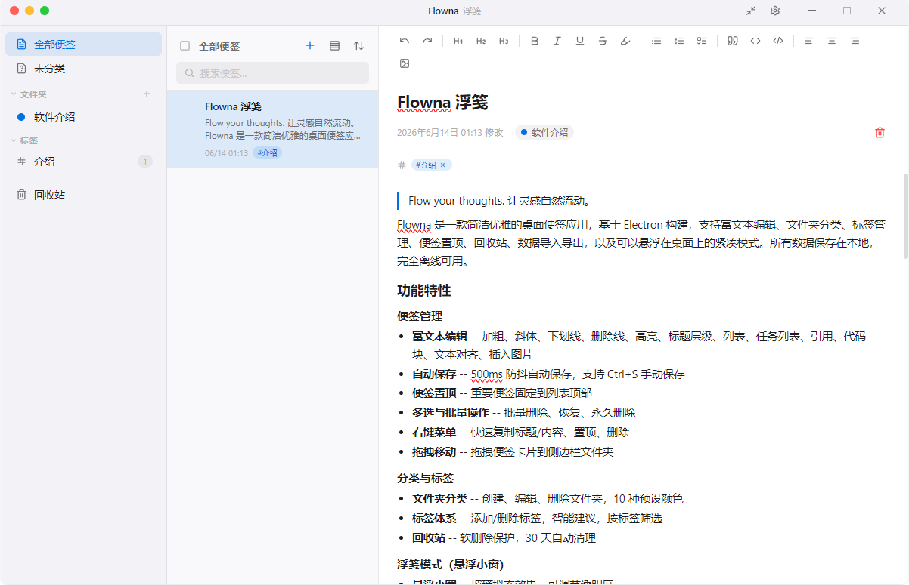
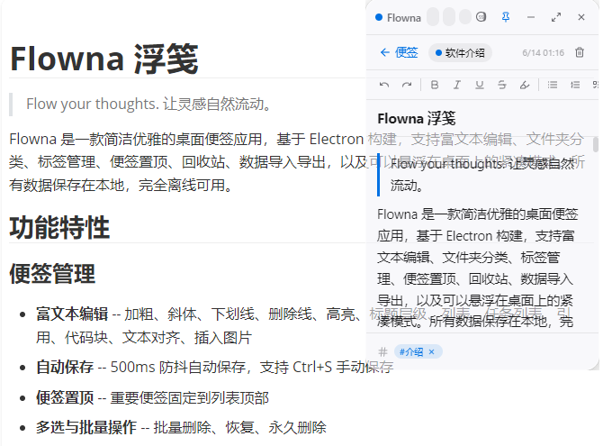

# Flowna 浮笺

> Flow your thoughts. 让灵感自然流动。

Flowna 是一款简洁优雅的桌面便签应用，基于 Electron 构建，支持富文本编辑、文件夹分类、标签管理、便签置顶、回收站、数据导入导出，以及可以悬浮在桌面上的浮笺模式。所有数据保存在本地，完全离线可用。

## 功能特性

### 便签管理
- **富文本编辑** -- 加粗、斜体、下划线、删除线、高亮、标题层级、列表、任务列表、引用、代码块、文本对齐、插入图片
- **自动保存** -- 500ms 防抖自动保存，支持 Ctrl+S 手动保存
- **便签置顶** -- 重要便签固定到列表顶部
- **多选与批量操作** -- 批量删除、恢复、永久删除
- **右键菜单** -- 快速复制标题/内容、置顶、删除
- **拖拽移动** -- 拖拽便签卡片到侧边栏文件夹

### 分类与标签
- **文件夹分类** -- 创建、编辑、删除文件夹，10 种预设颜色
- **标签体系** -- 添加/删除标签，智能建议，按标签筛选
- **回收站** -- 软删除保护，30 天自动清理

### 浮笺模式（悬浮小窗）
- **悬浮小窗** -- 玻璃拟态效果，可调节透明度
- **窗口置顶** -- 始终位于其他窗口上方，方便随时查找内容、复制粘贴
- **完整功能** -- 筛选、搜索、排序、新建、编辑一应俱全

### 界面与体验
- **主题切换** -- 浅色、深色、跟随系统
- **列表密度** -- 舒适模式 / 紧凑模式
- **搜索与排序** -- 按标题/正文/标签搜索，多种排序方式
- **无边框窗口** -- 自定义标题栏，适配 macOS 和 Windows
- **快捷键** -- Ctrl+N 新建、Ctrl+F 搜索

### 数据安全
- **本地存储** -- SQLite 数据库，WAL 模式
- **导入导出** -- JSON 格式备份，支持合并导入和替换导入

## 界面截图

- 主界面



- 浮笺模式（悬浮小窗）



## 环境要求

- Node.js >= 18
- npm >= 9

## 构建与运行

### 安装依赖

```bash
npm install
```

> 注意：better-sqlite3 包含原生模块，安装后会自动执行 `electron-rebuild`。

### 开发模式

```bash
npm run dev
```

Windows 下也可直接运行 `start.bat` 或 `Flowna.vbs`。

### 构建

```bash
npm run build
```

### 封装好的软件：

windows版本软件下载链接（可直接安装使用）：https://pan.quark.cn/s/274fe9dce344

## 许可证

本作品采用 [知识共享署名-非商业性使用-相同方式共享 4.0 国际许可协议](https://creativecommons.org/licenses/by-nc-sa/4.0/)（CC BY-NC-SA 4.0）进行许可。

[查看 LICENSE 文件](LICENSE)
